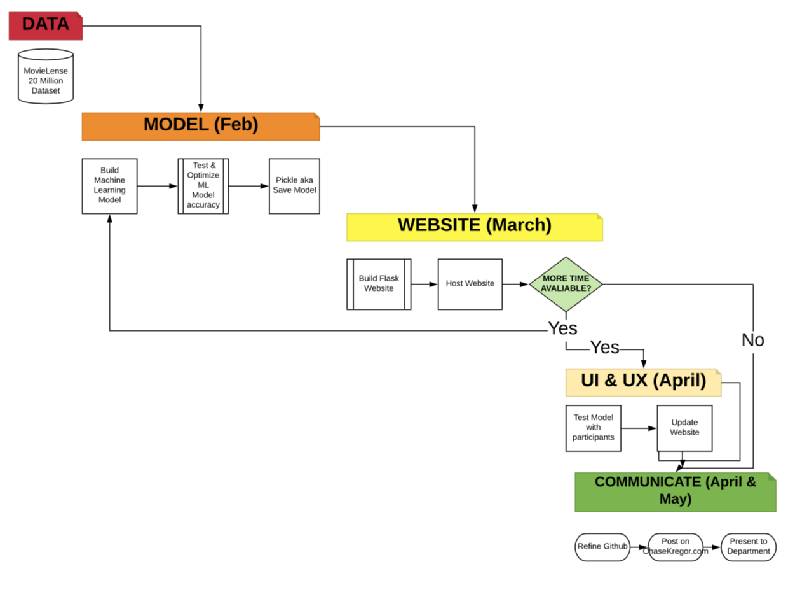
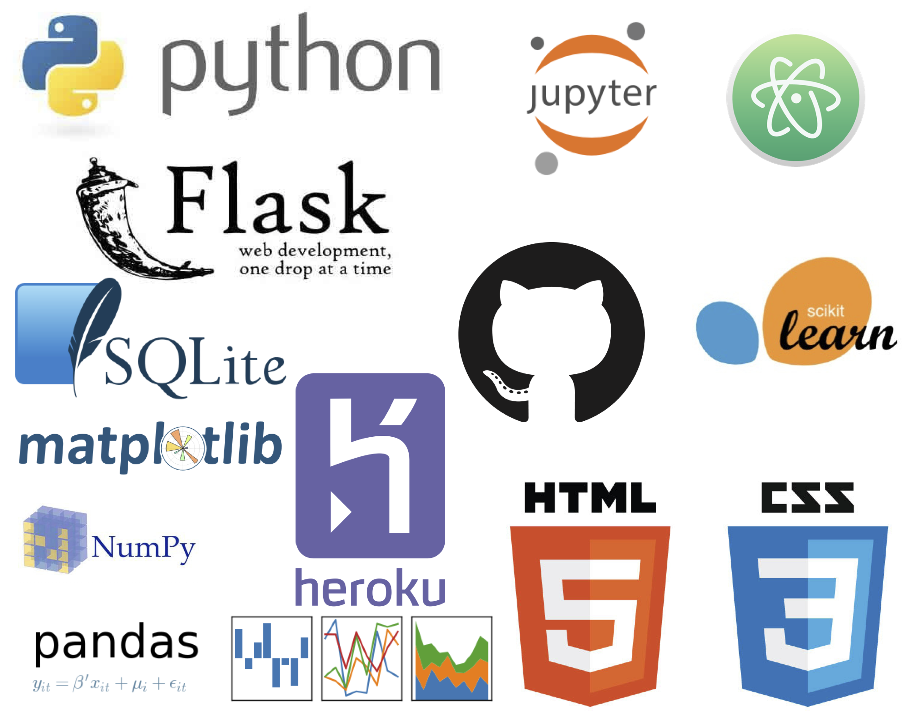

# MoviRec

## Creating Movie Recommendations With Machine Learning

### Objective

MoviRec is the capstone project for Chase Kregor's B.S. in Information Science at the University of Colorado Boulder.

A great way to display technical capabilities is to show skills in Machine Learning. The ability to project people’s future preferences is extremely valuable. Considering everyone and the layman loves movies, why not build a great movie recommender?

### Table of Contents
1. [Data](#data)
2. [Project](#project)
3. [Results & Presentation](#results-and-presentation)
4. [Next Steps](#next-steps)
5. [References](#references)
6. [Tech Stack](#tech-stack)
7. [Reproducibility](#reproducibility)

### Data

I am using the [MovieLens 20M Dataset](https://grouplens.org/datasets/movielens/20m/), it is considered on of the most robust movie rating datasets of all time and is maintained by GroupLens, which is a research lab in the Department of Computer Science and Engineering at the University of Minnesota, Twin Cities.

### Project

- Loading the Data
- Building the ML Models
  - Results
- Building the Flask Website
- Hosting Flask Website

### Results
Project has very hard but very rewarding.

### Presentation
I presented my capstone at the annual INFO showcase. The link to the video can be found here.

### Next Steps & Future Work

Model optimization.

### References & Thanks
- [Create a scikit-learn based prediction webapp using Flask and Heroku](https://xcitech.github.io/tutorials/heroku_tutorial/)
- [The Flask Mega-Tutorial Part II: Templates][https://blog.miguelgrinberg.com/post/the-flask-mega-tutorial-part-ii-templates]
- My fellow INFO Buff, Kyle Frye helped out on this project. I can't thank him enough for his support.
- Dr. Micheal Paul with help on the ML models.
- Dr. Brian Keegan with overall guidance.
- Dr. Lecia Barker for teaching the class and helping me refine the project.

### Tech Stack

### Reproducibility

Downloading the MovieLense dataset and loading it onto a single computer can be very difficult. On top of this Github has a file upload limit which stops me from being able to upload the dataset that I used. If you want to download the CSV I used go to the link in the data folder.

1. Git clone https://github.com/chasekregor/INFOCapstone.git
2. Download the [dataset](https://grouplens.org/datasets/movielens/20m/) at by [clicking here](http://files.grouplens.org/datasets/movielens/ml-20m.zip) and drag the "ml-20m" folder with all the CSVs into the repository you just downloaded.
3. Run create_db_and_model.ipynb
4. Navigate to flask-app folder and run app.py. The website should be served at [http://127.0.0.1:5000/](http://127.0.0.1:5000/).
